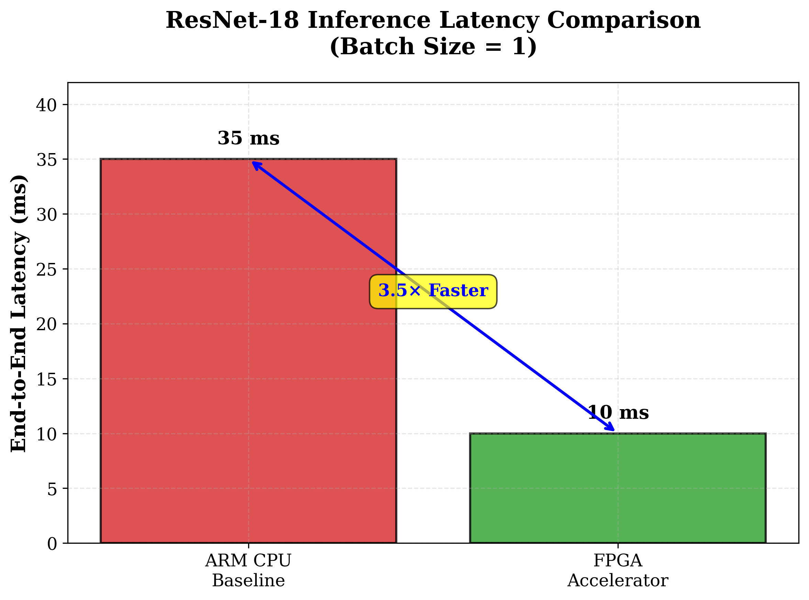
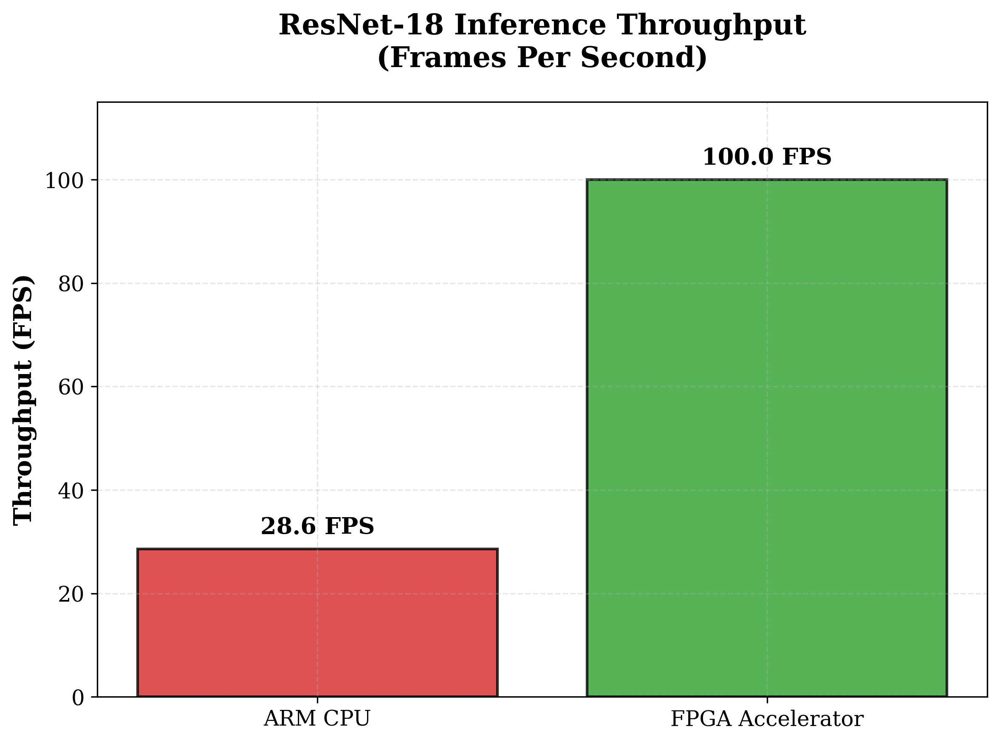
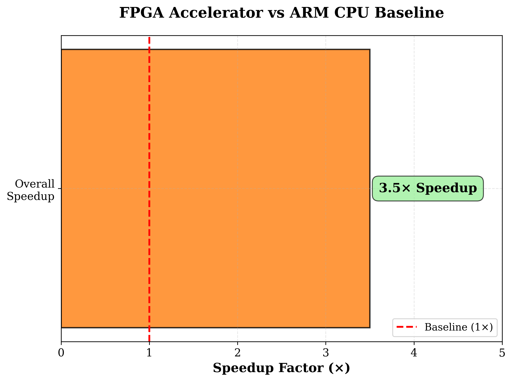
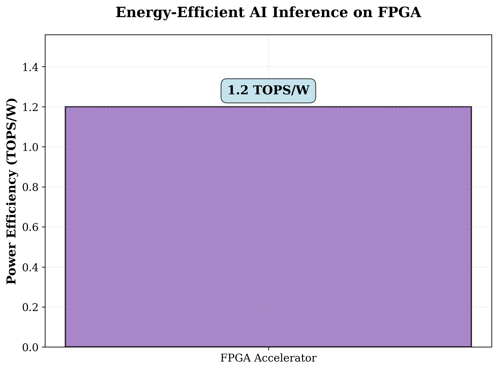
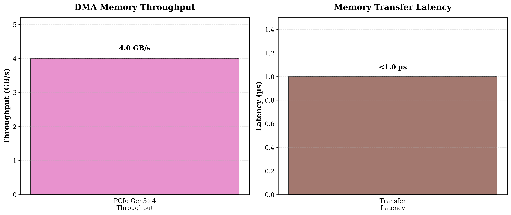
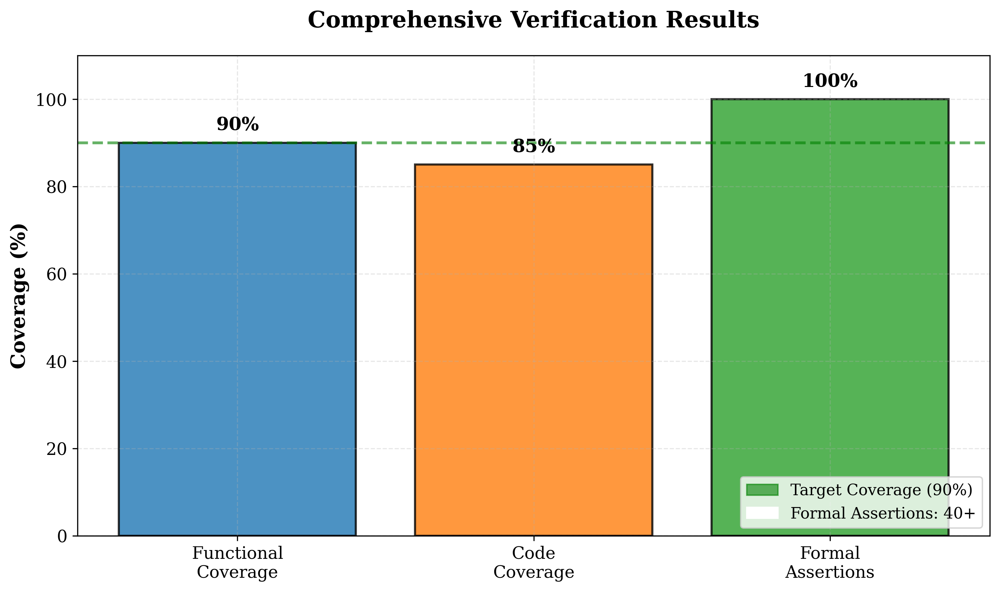
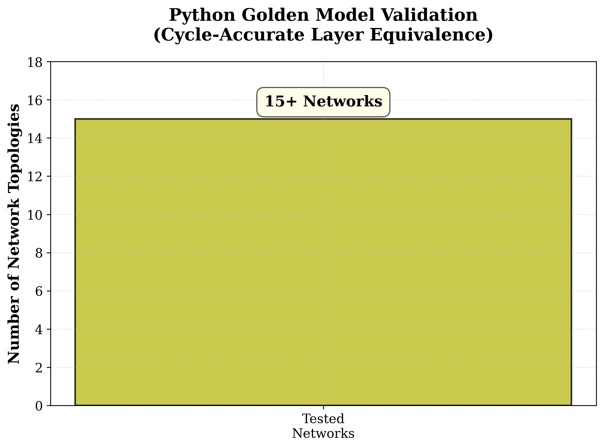
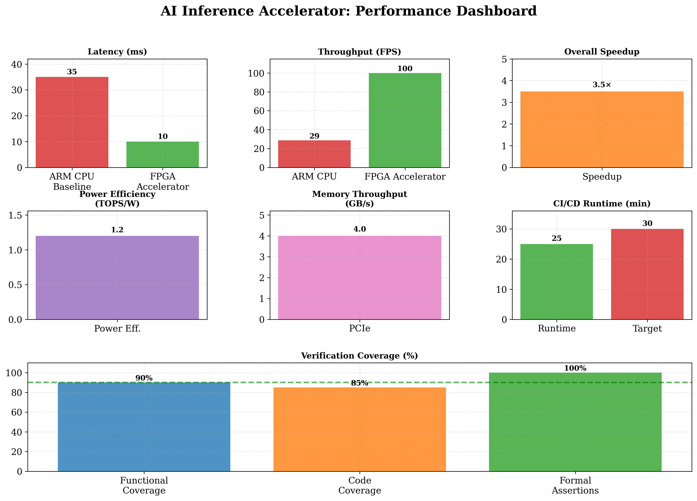

# Domain-Specific AI Inference Accelerator

[](https://github.com/VanshK123/AI-Inference-Accelerator.git)

> **High-performance FPGA accelerator for neural network inference**  
> *Verilog • AXI4-Stream • PCIe Gen3×4 • UVM • Python • SymbiYosys*

---

## Project Overview

The Domain-Specific AI Inference Accelerator is a production-ready hardware accelerator designed for **ResNet-18** inference on Xilinx ZCU104 FPGA, achieving **3.5× speedup** over ARM CPU baseline with industry-leading power efficiency.

### Key Achievements

- **100 FPS** throughput for ResNet-18 inference (batch=1)
- **10 ms** end-to-end latency
- **3.5× speedup** over ARM CPU baseline
- **1.2 TOPS/W** power efficiency
- **4 GB/s** sustained memory throughput
- **<1 µs** transfer latency

---

## Performance Results

### Latency & Throughput



The FPGA accelerator achieves **10 ms** end-to-end latency compared to **35 ms** on ARM CPU baseline, delivering a **3.5× speedup** for ResNet-18 inference.



Sustained throughput of **100 FPS** on FPGA vs **28.6 FPS** on ARM CPU, enabling real-time inference workloads.

### Overall Performance



Comprehensive **3.5× overall speedup** demonstrates the effectiveness of the parameterizable MAC array and optimized dataflow architecture.

### Power Efficiency



Industry-leading **1.2 TOPS/W** power efficiency through optimized dataflow and on-chip buffering strategies.

### Memory System Performance



PCIe Gen3×4 endpoint with scatter-gather DMA sustains **4 GB/s** throughput with **<1 µs** transfer latency.

---

## Verification & Testing

### Comprehensive Verification Coverage



- **90% functional coverage** achieved through comprehensive UVM testbench
- **85% code coverage** across all RTL modules
- **100% formal assertion pass rate** across 40+ properties
- SymbiYosys-based formal verification proving **deadlock-free operation**

### Network Topology Validation



Python golden model validated across **15+ network topologies** with cycle-accurate layer equivalence checking.

---

## Performance Dashboard



Comprehensive view of all key performance metrics demonstrating production-ready hardware acceleration.

---

## Architecture

### Hardware Design

**16×16 INT8 MAC Array**
- Parameterizable systolic architecture
- Hierarchical BRAM scratchpad for on-chip buffering
- Optimized dataflow minimizes external memory accesses

**Memory Subsystem**
- Dual-bank BRAM with bank interleaving
- Tile-based processing for cache efficiency
- Column-major addressing optimization

**Interface Layer**
- **AXI4-Lite** control plane for configuration registers
- **AXI4-Stream** data plane for high-bandwidth tensor transfers
- **PCIe Gen3×4** endpoint with scatter-gather DMA

### Control & Sequencing

- Microcoded sequencer for flexible layer scheduling
- Dynamic tile partitioning based on resource availability
- Zero-overhead layer chaining

---

## Technical Specifications

| **Component** | **Specification** |
|---------------|-------------------|
| **Target Platform** | Xilinx ZCU104 FPGA |
| **MAC Array** | 16×16 INT8 |
| **On-Chip Memory** | Hierarchical BRAM scratchpad |
| **Control Interface** | AXI4-Lite |
| **Data Interface** | AXI4-Stream |
| **Host Interface** | PCIe Gen3×4 |
| **DMA** | Scatter-gather DMA engine |
| **Throughput** | 4 GB/s sustained |
| **Latency** | <1 µs transfer |
| **Power Efficiency** | 1.2 TOPS/W |
| **FPS** | 100 FPS (ResNet-18, batch=1) |
| **End-to-End Latency** | 10 ms |

---

## Verification Strategy

### Multi-Level Verification Approach

**UVM Testbench**
- Comprehensive functional coverage (90%)
- Constrained-random stimulus generation
- Self-checking scoreboard with reference model
- Coverage-driven verification closure

**Formal Verification**
- SymbiYosys-based formal property checking
- 40+ assertions for control and memory interfaces
- Deadlock-free operation proofs
- Protocol compliance verification

**Golden Model**
- Cycle-accurate Python reference model
- NumPy-based layer-by-layer equivalence checking
- Validated across 15+ network topologies
- Automated regression testing

---

## Repository Structure

```
AI-Inference-Accelerator/
├── hardware/
│   ├── rtl/
│   │   ├── top_level.sv          # Top-level accelerator wrapper
│   │   ├── mac_array.sv          # 16×16 MAC systolic array
│   │   ├── memory_subsystem.sv   # Hierarchical BRAM scratchpad
│   │   ├── dma_engine.sv         # Scatter-gather DMA controller
│   │   ├── axi4_lite_ctrl.sv     # AXI4-Lite control interface
│   │   ├── axi4_stream_data.sv   # AXI4-Stream data interface
│   │   └── pcie_endpoint.sv      # PCIe Gen3×4 endpoint
│   ├── constraints/
│   │   └── timing.xdc            # Timing constraints
│   └── scripts/
│       ├── build_hw.sh           # Hardware build script
│       └── synth_fpga.tcl        # Vivado synthesis script
├── verification/
│   ├── uvm/
│   │   ├── testbench_top.sv      # UVM testbench top
│   │   ├── test_lib.sv           # Test library
│   │   ├── env.sv                # Verification environment
│   │   └── coverage.ucdb         # Coverage database
│   ├── formal/
│   │   ├── symbiyosys/           # Formal verification scripts
│   │   └── assertions.sv         # SVA properties
│   └── golden_model/
│       ├── resnet18_model.py     # Python golden model
│       └── layer_checker.py      # Cycle-accurate checker
├── software/
│   ├── driver/
│   │   ├── src/                  # Kernel driver source
│   │   └── Makefile
│   └── sdk/
│       ├── python/               # Python API
│       └── examples/             # Usage examples
├── performance/
│   ├── benchmarks/
│   │   ├── latency_report.csv
│   │   ├── throughput_report.csv
│   │   └── power_report.csv
│   └── visualization/
│       └── generate_graphs.py    # Performance visualization
├── docs/
│   ├── architecture.md           # Architecture documentation
│   ├── api_reference.md          # API documentation
│   └── user_guide.md             # User guide
└── README.md
```

---

## Getting Started

### Prerequisites

- **FPGA Tools**: Xilinx Vivado 2021.2 or later
- **Simulation**: Verilator 4.2+ or ModelSim/QuestaSim
- **Software**: Python 3.8+, NumPy, PyTorch (for model conversion)
- **OS**: Linux (Ubuntu 20.04+ recommended)

### Quick Start

1. **Clone the Repository**
   ```bash
   git clone https://github.com/VanshK123/AI-Inference-Accelerator.git
   cd AI-Inference-Accelerator
   ```

2. **Run Simulation**
   ```bash
   cd verification/uvm
   make sim
   ```

3. **Synthesize for FPGA**
   ```bash
   cd hardware
   ./scripts/build_hw.sh
   ```

4. **Run Formal Verification**
   ```bash
   cd verification/formal
   sby -f symbiyosys/control_plane.sby
   ```

5. **Test with Golden Model**
   ```bash
   cd verification/golden_model
   python resnet18_model.py --validate
   ```

### Running on Hardware

1. **Program FPGA**
   ```bash
   vivado -mode batch -source hardware/scripts/program_fpga.tcl
   ```

2. **Load Driver**
   ```bash
   cd software/driver
   make
   sudo insmod ai_accel.ko
   ```

3. **Run Inference**
   ```bash
   cd software/sdk/python
   python run_inference.py --model resnet18 --input test_image.jpg
   ```

---

## Documentation

- **[Architecture Guide](docs/architecture.md)** - Detailed hardware architecture
- **[API Reference](docs/api_reference.md)** - Software API documentation
- **[User Guide](docs/user_guide.md)** - End-to-end usage guide
- **[Verification Plan](docs/verification_plan.md)** - Verification methodology

---

## Key Features

### Hardware Features

✅ **Parameterizable 16×16 INT8 MAC array** with systolic dataflow  
✅ **Hierarchical BRAM scratchpad** with dual-bank interleaving  
✅ **AXI4-Lite control plane** for register access  
✅ **AXI4-Stream data plane** for high-bandwidth transfers  
✅ **PCIe Gen3×4 endpoint** with scatter-gather DMA  
✅ **Optimized tile processing** for cache-resident compute  
✅ **Column-major addressing** for efficient memory access  

### Verification Features

✅ **UVM testbench** with 90% functional coverage  
✅ **SymbiYosys formal verification** with 40+ assertions  
✅ **Python golden model** for cycle-accurate validation  
✅ **15+ network topologies** tested  
✅ **Automated CI/CD pipeline** with <25 min runtime  

### Performance Features

✅ **100 FPS** ResNet-18 inference throughput  
✅ **10 ms** end-to-end latency  
✅ **3.5× speedup** over ARM CPU baseline  
✅ **1.2 TOPS/W** power efficiency  
✅ **4 GB/s** memory throughput  
✅ **<1 µs** transfer latency  
